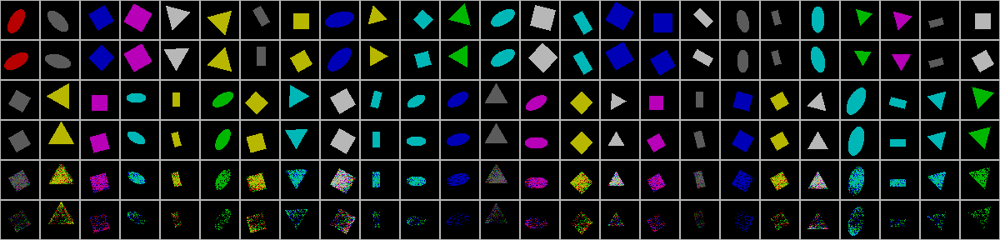
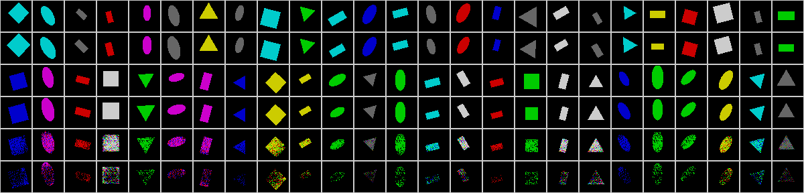
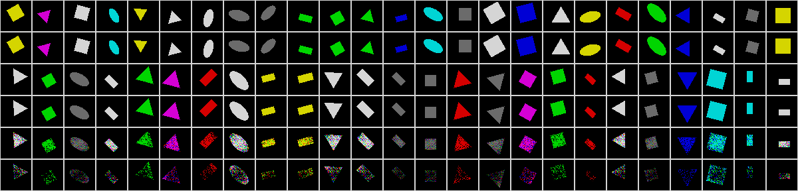

Deep Visual Analogy-Making
==========================

Tensorflow implementation of [Deep Visual Analogy-Making](http://www-personal.umich.edu/~reedscot/nips2015.pdf). The matlab code of the paper can be found [here](http://www-personal.umich.edu/~reedscot/files/nips2015-analogy.tar.gz).

This implementation contains a deep network trained end-to-end to perform visual analogy making with

1. Fully connected encoder & decoder networks
2. Analogy transformations by vector addition and deep networks (vector multiplication is not implemented)
3. Regularizer for manifold traversal transformations

This implementation conatins:

1. Analogy transformations of `shape` dataset
    - with objective for vector-addition-based analogies (L_add)
    - with objective for multiple fully connected layers (L_deep)
    - with manifold traversal transformations

Prerequisites
-------------

- Python 2.7 or Python 3.3+
- [Tensorflow](https://www.tensorflow.org/)
- [SciPy](http://www.scipy.org/)

Usage
-----

First, you need to download the dataset with:

    $ ./download.sh

To train a model with `shape` dataset:

    $ python main.py --dataset shape --is_train True

To test a model with `shape` dataset:

    $ python main.py --dataset shape 

Results
-------

Result of analogy transformations of `shape` dataset with fully connected layers (L_deep).

*Reference*, *output*, *query*, *target*, *prediction*, *manifold prediction after 2 step*, and *manifold prediction after 3 step* *, in order from top to bottom in each image.

- Change on angle

- Change on scale

- Change on x position

- Change on y position

Training details
----------------

Reference
---------

- [NIPS 2015 slide](http://www-personal.umich.edu/~reedscot/files/nips2015-analogy-slides.pptx)

Author
------

Taehoon Kim / [@carpedm20](http://carpedm20.github.io/)
