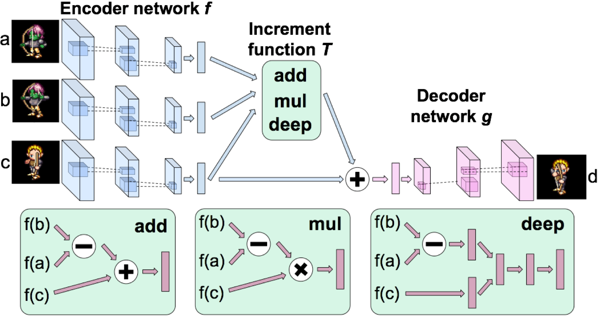
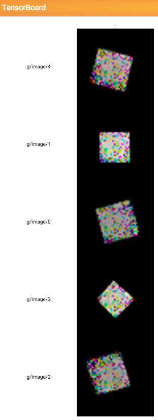

Deep Visual Analogy-Making
==========================

Tensorflow implementation of [Deep Visual Analogy-Making](http://www-personal.umich.edu/~reedscot/nips2015.pdf). The matlab code of the paper can be found [here](http://www-personal.umich.edu/~reedscot/files/nips2015-analogy.tar.gz).

This implementation contains a deep network trained end-to-end to perform visual analogy making with

1. Fully connected encoder & decoder networks
2. Analogy transformations by vector addition and deep networks (vector multiplication is not implemented)
3. Regularizer for manifold traversal transformations

This implementation conatins:

1. Analogy transformations dependent on the query context
    - with Objective for vector-addition-based analogies (L_add)
    - with Objective for multiple fully connected layers (L_deep)
2. Analogy-making with a disentangled feature representation
    - without objective for classifiers (L_dis)
    - with objective for multiple softmax classifiers (L_{dis+cls})

Prerequisites
-------------

- Python 2.7 or Python 3.3+
- [Tensorflow](https://www.tensorflow.org/)
- [SciPy](http://www.scipy.org/)

Usage
-----

First, you need to download the dataset with:

    $ ./download.sh

To train a model with `sprite` (2d game character) dataset:

    $ python main.py --dataset sprite --is_train True

To test a model with `sprite` dataset:

    $ python main.py --dataset sprite

(in progress)

Results
-------

(in progress)

Training details
----------------

(in progress)

Author
------

Taehoon Kim / [@carpedm20](http://carpedm20.github.io/)
